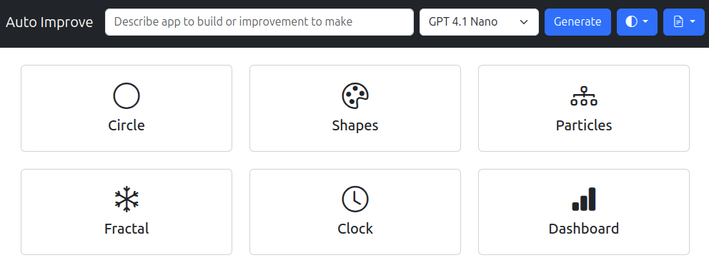

# README

<section data-target="#introduction">

What if you ask an LLM to `Improve the code - dramatically!` again and again?

We pushed the newly released [GPT 4.1 Nano](https://platform.openai.com/docs/models/gpt-4.1-nano), a fast, cheap, and fairly capable model to write code for a few _simple_ tasks like <q>Draw a circle</q>.

Then, we passed the code back to it, and asked it to `Improve the code - dramatically!` multiple times.

Here are the results.

</section>

<section data-target="#observations">

A few observations.

- **Models are getting _much_ more reliable**. Even a cheap model like [GPT 4.1 Nano](https://platform.openai.com/docs/models/gpt-4.1-nano) produced error-free code across ~100 attempts.
- **When pushed, they tend to brag**, giving their code titles like <q>Ultimate Interactive Circle</q>, <q>Ultimate Data Dashboard 2024</q>, and even <q>Galactic Data Universe</q> and descriptions like <q>This dramatically upgraded clock features a pulsating neon glow, animated pulsing background glow, highly stylized tick marks, and a vibrant color palette, creating an ultra-futuristic cyberpunk aesthetic with smooth real-time updates.</q>
- **A simple prompt like `Improve it` can be good for ideation**, to discover features like:
  - [Fading trails on particles](https://sanand0.github.io/autoimprove/#apps/particles.json)
  - [Smooth color mapping for fractals](https://sanand0.github.io/autoimprove/#apps/fractal.json)
  - [Choice of libraries like Chart.js for dashboards](https://sanand0.github.io/autoimprove/#apps/dashboard.json)
  - [Cyberpunk clocks](https://sanand0.github.io/autoimprove/#apps/clock.json)
  - ... and a [smorgasbord of intricate animated patterns](https://sanand0.github.io/autoimprove/#apps/shapes.json)

</section>
